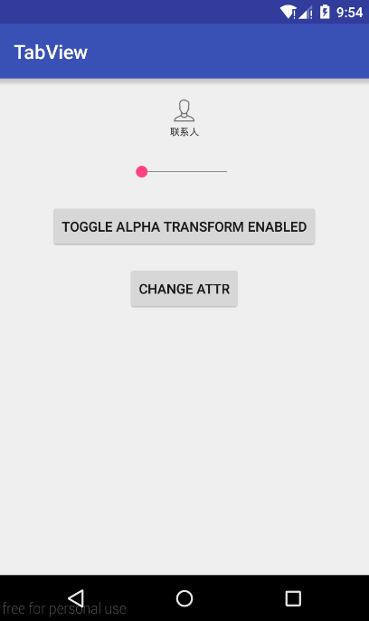
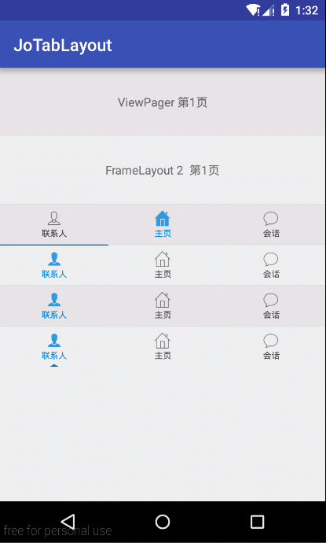

JoTabLayout
===========

A TabLayout without dependence of ViewPager.  

Thanks for [CommonTabLayout][1] and [AlphaIndicatorView][2].  


Demo
----






Usage
-----

- **XML**

```xml
<com.tomeokin.widget.jotablayout.JoTabLayout
        android:id="@+id/tabLayout"
        android:layout_width="match_parent"
        android:layout_height="48dp"
        android:orientation="horizontal"
        >

      <com.tomeokin.widget.jotablayout.TabView
          android:layout_width="0dp"
          android:layout_height="match_parent"
          android:layout_weight="1"
          android:paddingBottom="8dp"
          android:paddingTop="8dp"
          app:tabIconNormal="@drawable/tab_contact_unselect"
          app:tabIconSelected="@drawable/tab_contact_select"
          app:textColorNormal="@color/grey800"
          app:textColorSelected="@color/lightBlue700"
          app:tabTitle="联系人"
          />

      <com.tomeokin.widget.jotablayout.TabView
          android:layout_width="0dp"
          android:layout_height="match_parent"
          android:layout_weight="1"
          android:paddingBottom="8dp"
          android:paddingTop="8dp"
          app:tabIconNormal="@drawable/tab_home_unselect"
          app:tabIconSelected="@drawable/tab_home_select"
          app:textColorNormal="@color/grey800"
          app:textColorSelected="@color/lightBlue700"
          app:tabTitle="主页"
          />

      <com.tomeokin.widget.jotablayout.TabView
          android:layout_width="0dp"
          android:layout_height="match_parent"
          android:layout_weight="1"
          android:paddingBottom="8dp"
          android:paddingTop="8dp"
          app:tabIconNormal="@drawable/tab_speech_unselect"
          app:tabIconSelected="@drawable/tab_speech_select"
          app:textColorNormal="@color/grey800"
          app:textColorSelected="@color/lightBlue700"
          app:tabTitle="会话"
          />

</com.tomeokin.widget.jotablayout.JoTabLayout>
```

- **Java**

```java
mTabLayout.setOnTabSelectedListener(new OnTabSelectedListener() {
      @Override
      public void onTabSelect(View view, int position) {
        if (mViewPager != null) {
          mViewPager.setCurrentItem(position, false);
        }
        setCurrentFragment(position);
      }

      @Override
      public void onTabReselect(View view, int position) {

      }
    });
mTabLayout.applyConfigurationWithViewPager(mViewPager, alphaTransformEnabled);
```

*The above example extract from activity_tablayout.xml and TabLayoutActivity.java, a little changed.*


Download
--------

Gradle:
```
allprojects {
  repositories {
    jcenter()
  }
}

dependencies {
  compile 'com.tomeokin.widget.jotablayout:lib:1.0.2@aar'
}
```


License
=======

```
Copyright 2016 TomeOkin

Licensed under the Apache License, Version 2.0 (the "License");
you may not use this file except in compliance with the License.
You may obtain a copy of the License at

    http://www.apache.org/licenses/LICENSE-2.0

Unless required by applicable law or agreed to in writing, software
distributed under the License is distributed on an "AS IS" BASIS,
WITHOUT WARRANTIES OR CONDITIONS OF ANY KIND, either express or implied.
See the License for the specific language governing permissions and
limitations under the License.
```


[1]: https://github.com/H07000223/FlycoTabLayout
[2]: https://github.com/jeasonlzy0216/AlphaIndicatorView